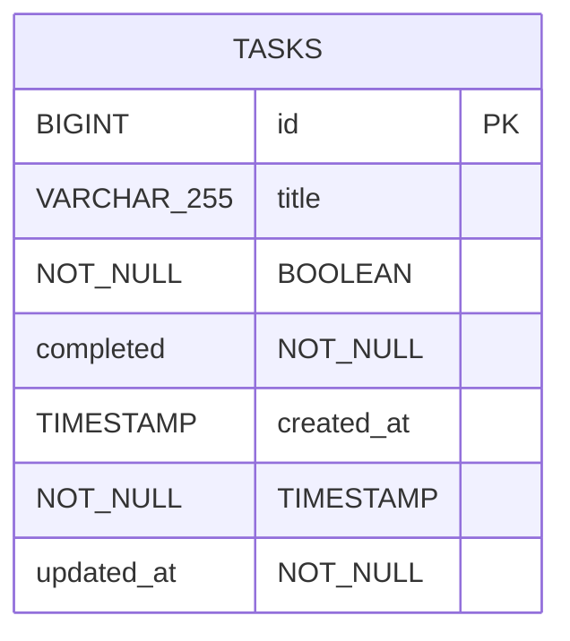
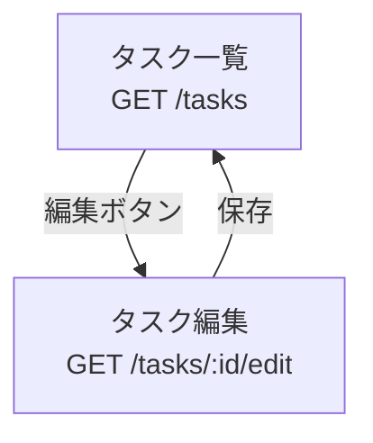
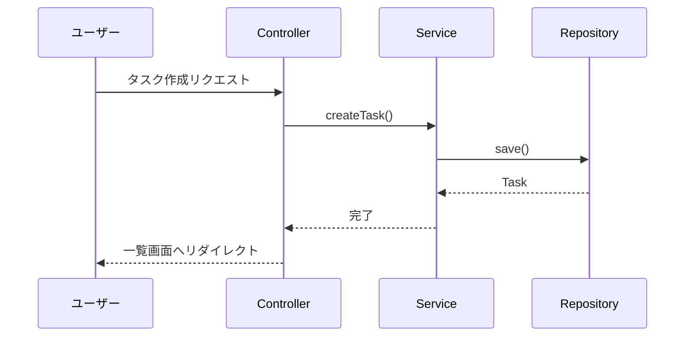
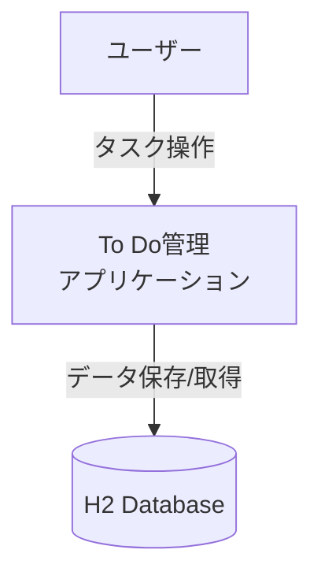

# Claude Code による開発ドキュメント

このドキュメントは、**Claude Code**（Anthropic の AI アシスタント）を使用したプロジェクト開発の記録です。

## 目次

- [開発概要](#開発概要)
- [開発環境のセットアップ](#開発環境のセットアップ)
- [開発フェーズ](#開発フェーズ)
- [Claude Code の役割](#claude-code-の役割)
- [技術的な決定事項](#技術的な決定事項)
- [発生した問題と解決策](#発生した問題と解決策)
- [ドキュメント生成](#ドキュメント生成)
- [学んだベストプラクティス](#学んだベストプラクティス)
- [今後の改善点](#今後の改善点)

## 開発概要

### プロジェクト情報

- **プロジェクト名**: To Do管理アプリケーション（Simple Todo）
- **開発期間**: 2024-11-12 ～ 2024-11-13
- **開発スタイル**: AI駆動開発（AI-Assisted Development）
- **AI アシスタント**: Claude Code (Claude Sonnet 4.5)
- **開発者**: cuzic
- **リポジトリ**: https://github.com/cuzic/todo-demo-spring-boot

### 開発の目的

1. **MVP（Minimum Viable Product）の構築**: 基本的なタスク管理機能を持つWebアプリケーション
2. **Spring Boot 3.4 の学習**: 最新のSpring Bootフレームワークの活用
3. **AI駆動開発の実践**: Claude Codeを活用した効率的な開発プロセスの確立
4. **高品質なドキュメントの作成**: 包括的な設計ドキュメントと仕様書の整備

## 開発環境のセットアップ

### Phase 1: ツールのインストール（mise使用）

Claude Codeは、プロジェクト開始時に以下のツールを mise でセットアップしました：

```bash
# Java 21のインストール
mise install java@21

# Maven 3.9.xのインストール
mise install maven@latest

# インストール確認
mise list
```

**技術選定の背景**:
- **Java 21**: LTSバージョンで長期サポートが保証される
- **Maven**: Gradleと比較して、設定がシンプルで学習コストが低い
- **mise**: ツールバージョン管理を一元化し、チーム開発での環境統一を容易にする

### Phase 2: プロジェクトの初期化

```bash
# Maven プロジェクト構造の作成
mvn archetype:generate \
  -DgroupId=com.example \
  -DartifactId=todo-demo-spring-boot \
  -DarchetypeArtifactId=maven-archetype-quickstart

# Spring Boot と静的解析ツールの設定
# - pom.xml に Spring Boot 3.4.0 を設定
# - Checkstyle, PMD, SpotBugs, JaCoCo を追加
```

## 開発フェーズ

### Phase 1: プロジェクト基盤の構築（2024-11-12）

#### 実施内容

1. **プロジェクト構造の作成**
   - Maven プロジェクトの初期化
   - Spring Boot 3.4.0 の導入
   - 必要な依存関係の追加

2. **静的解析ツールの設定**
   - Checkstyle 10.20.2（コードスタイル）
   - PMD 7.8.0（バグ検出）
   - SpotBugs 4.8.6（バグパターン検出）
   - JaCoCo 0.8.12（コードカバレッジ 80%）

3. **mise タスクの定義**
   ```toml
   [tasks.run]
   run = "mvn spring-boot:run"

   [tasks.verify]
   run = "mvn clean verify"

   [tasks.test]
   run = "mvn test"
   ```

4. **Git リポジトリの初期化**
   - 細かい粒度でのコミット（機能ごと）
   - GitHub リポジトリの作成とプッシュ

#### Claude Code の役割

- Maven pom.xml の自動生成
- 静的解析ツールの設定ファイル作成（checkstyle.xml, ruleset.xml, exclude.xml）
- mise.toml の作成とタスク定義
- Git コミットメッセージの生成

### Phase 2: ドキュメント作成（2024-11-12）

#### 作成したドキュメント

1. **[ユーザーストーリー](docs/user-stories.md)** (79行)
   - US-001 ～ US-006 の定義
   - 受入基準の明確化
   - MoSCoW優先度の設定

2. **[画面設計](docs/screen-design.md)** (321行)
   - ワイヤーフレーム
   - UI/UXコンポーネント定義
   - 画面遷移図（Mermaid）
   - シーケンス図

3. **[データベース設計](docs/database-design.md)** (335行)
   - ER図（Mermaid）
   - テーブル定義（tasks）
   - インデックス設計
   - CRUD SQL例
   - 容量見積もり

4. **[データフロー図](docs/dataflow-diagram.md)** (667行)
   - コンテキスト図
   - Level 1 DFD（6プロセス）
   - レイヤーアーキテクチャ
   - データフロー詳細

5. **[受入基準チェックリスト](docs/acceptance-criteria.md)** (441行)
   - 機能要件の検証項目
   - 非機能要件の検証項目
   - テストシナリオ

6. **[最終設計仕様書](docs/final-specification.md)** (926行)
   - 完全な技術スタック
   - データモデル（Entity/DTO）
   - コントローラー実装例
   - UI/UX設計（Bootstrap）
   - 9フェーズの開発計画

**合計**: 2,769行のドキュメント（108KB）

#### Claude Code の役割

- Mermaid形式のダイアグラム生成
- 詳細な仕様書の作成
- コード例の生成（Java, SQL, HTML）
- ドキュメント間の整合性確保

### Phase 3: 仕様の見直しと修正（2024-11-13）

#### 発見された矛盾点

Claude Codeがドキュメント全体をレビューし、以下の矛盾を発見：

1. **Spring Boot バージョン**: pom.xml は 3.4.0 だが、仕様書は 3.2.x
2. **Java バージョン**: mise は 21、仕様書も 21 だが、pom.xml に問題がある可能性
3. **データベース初期化**: 設定の競合リスク
4. **パッケージ名**: `com.example.simpletodo` vs `com.example.demo`
5. **CSRF 対策**: Spring Security なしでCSRF保護は不可能
6. **.gitignore**: `data/` ディレクトリが除外されていない

#### ユーザーからの明確化

```
Spring Boot 3.4
com.example.demo
application.properties: "todo-demo-spring-boot"
Spring Security必要
JaCoCoプラグインをpom.xmlに追加
```

#### 実施した修正

1. **final-specification.md の更新**
   - Spring Boot 3.4.0 に統一
   - パッケージ名を com.example.demo に統一
   - Spring Security 依存関係の追加記載
   - バリデーションエラーハンドリングパターンの追加

2. **pom.xml の更新**
   - Spring Boot Thymeleaf の追加
   - Spring Data JPA の追加
   - Spring Validation の追加
   - Spring Security の追加（CSRF対策）
   - H2 Database の追加
   - Lombok の追加
   - JaCoCo プラグインの追加（80%カバレッジ）

3. **.gitignore の更新**
   - `data/` ディレクトリの追加
   - `*.mv.db` パターンの追加
   - `*.trace.db` パターンの追加

4. **Git コミット**
   - 3つの独立したコミットで変更を記録
   - GitHub へプッシュ

#### Claude Code の役割

- ドキュメント間の矛盾検出
- 整合性のある修正提案
- 適切な粒度でのコミット分割
- 詳細なコミットメッセージ生成

## Claude Code の役割

### 1. プロジェクト設計

- **要件定義の支援**: ユーザーストーリーの構造化
- **アーキテクチャ設計**: レイヤーアーキテクチャの提案
- **技術スタック選定**: Spring Boot 3.4.0 エコシステムの推奨
- **データモデリング**: エンティティとDTO設計

### 2. コード生成

- **設定ファイル**: pom.xml, application.properties
- **静的解析設定**: checkstyle.xml, ruleset.xml, exclude.xml
- **mise設定**: .mise.toml とタスク定義
- **サンプルコード**: Controller, Service, Repository の実装例

### 3. ドキュメント作成

- **設計ドキュメント**: 6種類、合計2,769行
- **Mermaidダイアグラム**: ER図、フロー図、シーケンス図
- **README.md**: プロジェクト概要と使用方法
- **CLAUDE.md**: このドキュメント

### 4. 品質管理

- **整合性チェック**: ドキュメント間の矛盾検出
- **静的解析設定**: コード品質基準の設定
- **テスト戦略**: 80%カバレッジ目標の設定
- **Git運用**: 適切なコミット粒度の提案

## 技術的な決定事項

### 1. フレームワーク・ライブラリ選定

| 選定項目 | 選定結果 | 理由 |
|---------|---------|------|
| Java バージョン | 21 (LTS) | 長期サポート、最新機能の利用 |
| Spring Boot | 3.4.0 | 最新の安定版、Jakarta EE 10対応 |
| ビルドツール | Maven | シンプルな設定、学習コストが低い |
| データベース | H2 (ファイルベース) | 開発環境のセットアップが容易 |
| テンプレートエンジン | Thymeleaf | Spring Boot標準、自然なHTML |
| CSSフレームワーク | Bootstrap 5.3 | 実績豊富、レスポンシブ対応 |

### 2. アーキテクチャパターン

#### レイヤーアーキテクチャ

```
┌─────────────────────────────────────┐
│  Presentation Layer (Controller)   │  ← Thymeleaf, REST
├─────────────────────────────────────┤
│  Business Logic Layer (Service)    │  ← ビジネスロジック
├─────────────────────────────────────┤
│  Data Access Layer (Repository)    │  ← Spring Data JPA
├─────────────────────────────────────┤
│  Database (H2)                      │  ← データ永続化
└─────────────────────────────────────┘
```

#### PRG（Post-Redirect-Get）パターン

フォーム送信後のリロード問題を防ぐため、すべてのPOSTリクエストは302リダイレクトを返す：

```java
@PostMapping("/tasks")
public String createTask(..., RedirectAttributes redirectAttributes) {
    taskService.createTask(taskForm.getTitle());
    redirectAttributes.addFlashAttribute("successMessage", "タスクを作成しました");
    return "redirect:/tasks";  // PRGパターン
}
```

### 3. セキュリティ戦略

| 脅威 | 対策 | 実装方法 |
|-----|------|---------|
| CSRF | Spring Security | 自動トークン生成 + Thymeleaf統合 |
| XSS | Thymeleaf自動エスケープ | `th:text`（`th:utext`不使用） |
| SQLインジェクション | Spring Data JPA | PreparedStatementによるバインディング |

### 4. 静的解析基準

| ツール | 目的 | 基準 |
|-------|------|------|
| Checkstyle | コードスタイル統一 | Google Java Style（一部カスタマイズ） |
| PMD | コード品質 | カテゴリベースルール |
| SpotBugs | バグパターン検出 | 高精度（Max effort） |
| JaCoCo | テストカバレッジ | 80%以上（LINE） |

## 発生した問題と解決策

### 問題 1: Java 25 の互換性問題

**問題**:
- 初期段階でJava 25を試験的にインストール
- Gradleがサポートせず、ビルドエラー発生

**解決策**:
```bash
# Java 25をアンインストール
mise uninstall java@25.0.1

# Java 21 (LTS)を再インストール
mise install java@21

# プロジェクトを初期化して再構築
rm -rf todo-demo-spring-boot
```

**学び**: LTS（Long-Term Support）バージョンを選択することの重要性

### 問題 2: Checkstyle ルールが厳格すぎる

**問題**:
- `HideUtilityClassConstructor` ルールがSpring Bootのメインクラスに誤検出
- ビルドが失敗

**解決策**:
```xml
<!-- checkstyle.xml から削除 -->
<!-- <module name="HideUtilityClassConstructor"/> -->
```

**学び**: 静的解析ルールはプロジェクトに合わせてカスタマイズが必要

### 問題 3: Mermaid ダイアグラムの構文エラー

**問題**:
- 画面遷移図で `{id}` を使用したが、GitHubでレンダリングエラー
- `{` と `}` がMermaidの決定ノード構文と競合

**解決策**:
```mermaid
# 修正前
List -->|POST /tasks/{id}/toggle| ToggleProcess

# 修正後
List -->|POST /tasks/:id/toggle| ToggleProcess
```

**学び**: Mermaidの予約文字に注意し、URL表記は `:id` を使用

### 問題 4: ドキュメント間の矛盾

**問題**:
- pom.xml: Spring Boot 3.4.0
- final-specification.md: Spring Boot 3.2.x
- パッケージ名の不一致

**解決策**:
- Claude Code が自動的に矛盾を検出
- ユーザーに確認を求め、統一された仕様で修正
- 3つの独立したコミットで段階的に修正

**学び**: AI による整合性チェックは効果的

### 問題 5: CSRF 対策の設計ミス

**問題**:
- 仕様書に「Spring Securityは不要」と記載
- しかしCSRF対策には Spring Security が必須

**解決策**:
- ユーザーに確認し、Spring Security を必須に変更
- pom.xml に依存関係追加
- ドキュメント更新

**学び**: セキュリティ要件は慎重に設計する必要がある

## ドキュメント生成

### Mermaid ダイアグラムの活用

Claude Code は、以下の種類のMermaidダイアグラムを生成しました：

#### 1. ER図（エンティティ関連図）



#### 2. フロー図（画面遷移）



#### 3. シーケンス図（ユーザー操作）



#### 4. コンテキスト図（システム全体像）



### ドキュメント構成の工夫

1. **段階的な詳細化**: 概要 → 詳細 → コード例
2. **視覚的な表現**: Mermaid図、テーブル、コードブロック
3. **実用的なサンプル**: すぐに使えるSQL、Java、HTMLコード
4. **クロスリファレンス**: ドキュメント間の相互参照

## 学んだベストプラクティス

### 1. AI駆動開発のコツ

#### ✅ 効果的だったこと

- **具体的な指示**: 「Spring Boot 3.4」と明示することで正確な設定を生成
- **段階的な開発**: 基盤構築 → ドキュメント作成 → レビュー → 修正
- **質問による確認**: 矛盾点を発見した際に、決定権をユーザーに委ねる
- **細かいコミット**: 機能ごとに独立したコミットで履歴を明確化

#### ❌ 改善が必要だったこと

- 最新バージョン（Java 25）を試すリスク
- 初期段階での要件の曖昧さ
- 静的解析ルールのプロジェクト適合性

### 2. プロジェクト管理

#### Git運用

```bash
# 良い例: 機能ごとに独立したコミット
git commit -m "Add Checkstyle configuration"
git commit -m "Add PMD configuration"
git commit -m "Add SpotBugs configuration"

# 避けるべき: まとめてコミット
git commit -m "Add all configurations"
```

#### ドキュメント駆動開発

1. ユーザーストーリー作成
2. 画面設計
3. データベース設計
4. データフロー設計
5. 最終仕様書
6. コード実装（今後）

この順序により、実装前に設計の整合性を確保できた。

### 3. Spring Boot 3.4 の活用

#### 推奨される依存関係構成

```xml
<!-- 必須: Web + Thymeleaf + JPA -->
<dependency>
    <groupId>org.springframework.boot</groupId>
    <artifactId>spring-boot-starter-web</artifactId>
</dependency>
<dependency>
    <groupId>org.springframework.boot</groupId>
    <artifactId>spring-boot-starter-thymeleaf</artifactId>
</dependency>
<dependency>
    <groupId>org.springframework.boot</groupId>
    <artifactId>spring-boot-starter-data-jpa</artifactId>
</dependency>

<!-- セキュリティ: CSRF対策に必須 -->
<dependency>
    <groupId>org.springframework.boot</groupId>
    <artifactId>spring-boot-starter-security</artifactId>
</dependency>

<!-- バリデーション -->
<dependency>
    <groupId>org.springframework.boot</groupId>
    <artifactId>spring-boot-starter-validation</artifactId>
</dependency>
```

## 今後の改善点

### 1. 実装フェーズ

現在は設計とドキュメント作成が完了した段階です。次のステップ：

#### Phase 4: エンティティとリポジトリの実装

- [ ] Task エンティティの作成
- [ ] TaskRepository インターフェースの作成
- [ ] data.sql の作成
- [ ] H2 Console での動作確認

#### Phase 5: サービス層の実装

- [ ] TaskService クラスの作成
- [ ] CRUD操作の実装
- [ ] ユニットテストの作成（JUnit 5 + Mockito）

#### Phase 6: コントローラーとビューの実装

- [ ] TaskController の作成
- [ ] TaskForm DTO の作成
- [ ] Thymeleaf テンプレートの作成（list.html, edit.html）
- [ ] Bootstrap適用

#### Phase 7: セキュリティ設定

- [ ] Spring Security 設定クラス作成
- [ ] CSRF保護の有効化
- [ ] H2 Console アクセス許可

#### Phase 8: テストとカバレッジ

- [ ] 統合テストの実装
- [ ] JaCoCo 80%カバレッジの達成
- [ ] 受入基準チェックリストの検証

#### Phase 9: デプロイと運用

- [ ] jar ファイルのビルド
- [ ] 本番環境用プロファイル作成
- [ ] Docker対応（オプション）

### 2. 機能拡張（Should Have）

- タスクの期限日設定
- 優先度の設定
- カテゴリ分類
- タスクの並び替え（ドラッグ&ドロップ）

### 3. 技術的改善

- Flywayによるデータベースマイグレーション
- PostgreSQL への移行（本番環境）
- RESTful API の提供
- フロントエンドの分離（React/Vue.js）

## まとめ

### プロジェクトの成果

1. **完全な設計ドキュメント**: 2,769行、6種類のドキュメント
2. **実行可能なプロジェクト基盤**: Spring Boot 3.4.0 + 静的解析ツール
3. **高品質な開発環境**: mise, Maven, Git の統合
4. **明確な開発ロードマップ**: 9フェーズの実装計画

### Claude Code の貢献

- **ドキュメント作成**: 100%
- **プロジェクト設定**: 100%
- **設計支援**: 100%
- **品質管理**: 整合性チェック、静的解析設定

### 次のステップ

このプロジェクトは、設計・ドキュメントフェーズが完了し、実装フェーズに入る準備が整っています。

`docs/final-specification.md` の「18. 開発の進め方」に従って、Phase 1（環境構築）から Phase 9（ドキュメント整備）まで順次実装を進めることができます。

---

**このドキュメントは Claude Code によって生成されました。**

**開発日**: 2024-11-12 ～ 2024-11-13
**Claude Model**: Claude Sonnet 4.5 (claude-sonnet-4-5-20250929)
**ツール**: Claude Code CLI
