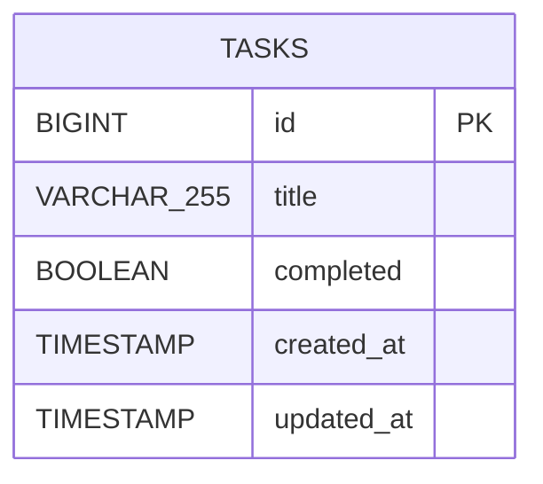
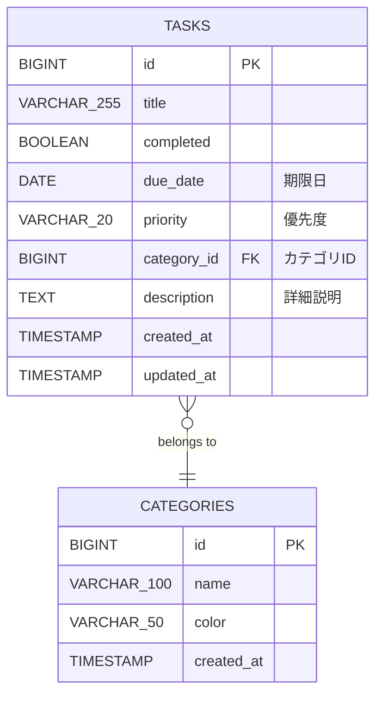

# To Do管理アプリケーション - ER図（H2 Database）

## 1. エンティティ関連図（詳細版）

```mermaid
erDiagram
    TASKS {
        BIGINT id PK "主キー（自動採番）"
        VARCHAR_255 title NOT_NULL "タスクタイトル"
        BOOLEAN completed NOT_NULL "完了フラグ（デフォルト: false）"
        TIMESTAMP created_at NOT_NULL "作成日時（デフォルト: CURRENT_TIMESTAMP）"
        TIMESTAMP updated_at NOT_NULL "更新日時（デフォルト: CURRENT_TIMESTAMP）"
    }
```

## 2. テーブル詳細情報

### TASKS テーブル

| カラム名 | データ型 | PK | NOT NULL | DEFAULT | AUTO INCREMENT | 説明 |
|---------|---------|----|----|---------|----------------|------|
| id | BIGINT | ✓ | ✓ | - | ✓ | タスクID（主キー） |
| title | VARCHAR(255) | - | ✓ | - | - | タスクのタイトル |
| completed | BOOLEAN | - | ✓ | FALSE | - | 完了フラグ |
| created_at | TIMESTAMP | - | ✓ | CURRENT_TIMESTAMP | - | 作成日時 |
| updated_at | TIMESTAMP | - | ✓ | CURRENT_TIMESTAMP | - | 更新日時 |

## 3. 制約一覧

### 主キー制約
- **制約名**: `pk_tasks`
- **対象**: `id`
- **説明**: タスクを一意に識別する主キー

### CHECK制約
- **制約名**: `chk_title_not_empty`
- **対象**: `title`
- **条件**: `LENGTH(TRIM(title)) > 0`
- **説明**: タイトルが空文字列または空白のみでないことを保証

### NOT NULL制約
- `id`: NOT NULL
- `title`: NOT NULL
- `completed`: NOT NULL
- `created_at`: NOT NULL
- `updated_at`: NOT NULL

## 4. インデックス一覧

| インデックス名 | 対象カラム | タイプ | 説明 | 使用されるクエリ |
|-------------|-----------|-------|------|----------------|
| PRIMARY KEY | id | BTREE | 主キーインデックス | WHERE id = ? |
| idx_tasks_completed | completed | BTREE | 完了状態での検索用 | WHERE completed = ? |
| idx_tasks_created_at | created_at (DESC) | BTREE | 作成日時でのソート用 | ORDER BY created_at DESC |

## 5. データ例

### サンプルレコード

| id | title | completed | created_at | updated_at |
|----|-------|-----------|------------|------------|
| 1 | Spring Bootの環境構築 | false | 2024-11-12 10:00:00 | 2024-11-12 10:00:00 |
| 2 | データベース設計 | true | 2024-11-12 11:00:00 | 2024-11-12 15:30:00 |
| 3 | 画面設計書の作成 | false | 2024-11-12 12:00:00 | 2024-11-12 12:00:00 |
| 4 | To Doアプリの実装 | false | 2024-11-12 13:00:00 | 2024-11-12 13:00:00 |
| 5 | ユニットテストの作成 | false | 2024-11-12 14:00:00 | 2024-11-12 14:00:00 |

## 6. CRUD操作とSQL

### CREATE（作成）
```sql
INSERT INTO tasks (title, completed, created_at, updated_at)
VALUES ('新しいタスク', false, CURRENT_TIMESTAMP, CURRENT_TIMESTAMP);
```

### READ（読み取り）

**全件取得**
```sql
SELECT id, title, completed, created_at, updated_at
FROM tasks
ORDER BY created_at DESC;
```

**ID指定取得**
```sql
SELECT id, title, completed, created_at, updated_at
FROM tasks
WHERE id = ?;
```

**完了状態で絞り込み**
```sql
-- 未完了のみ
SELECT id, title, completed, created_at, updated_at
FROM tasks
WHERE completed = false
ORDER BY created_at DESC;

-- 完了済みのみ
SELECT id, title, completed, created_at, updated_at
FROM tasks
WHERE completed = true
ORDER BY created_at DESC;
```

### UPDATE（更新）

**タイトル更新**
```sql
UPDATE tasks
SET title = ?, updated_at = CURRENT_TIMESTAMP
WHERE id = ?;
```

**完了状態切り替え**
```sql
UPDATE tasks
SET completed = NOT completed, updated_at = CURRENT_TIMESTAMP
WHERE id = ?;
```

### DELETE（削除）
```sql
DELETE FROM tasks WHERE id = ?;
```

## 7. H2データベース固有の特性

### データ型マッピング

| Javaデータ型 | H2データ型 | サイズ |
|------------|-----------|-------|
| Long | BIGINT | 8 bytes |
| String | VARCHAR(n) | 可変長 |
| Boolean | BOOLEAN | 1 byte |
| LocalDateTime | TIMESTAMP | 8 bytes |

### AUTO_INCREMENT
- H2では `AUTO_INCREMENT` または `IDENTITY` を使用
- デフォルトで1から開始、1ずつ増加
- 削除したIDは再利用されない

### CURRENT_TIMESTAMP
- H2の組み込み関数
- 現在の日時を返す
- タイムゾーンはシステムのデフォルトを使用

## 8. テーブル統計情報

### 容量見積もり（10,000レコード想定）

| 項目 | サイズ |
|-----|-------|
| データ | 約1.75 MB |
| インデックス | 約500 KB |
| 合計 | 約2.25 MB |

### レコード数別のパフォーマンス目安

| レコード数 | 全件取得 | ID検索 | フィルター検索 |
|----------|---------|--------|--------------|
| 100件 | < 5ms | < 1ms | < 5ms |
| 1,000件 | < 10ms | < 1ms | < 10ms |
| 10,000件 | < 50ms | < 1ms | < 20ms |
| 100,000件 | < 200ms | < 1ms | < 50ms |

## 9. DDL（H2 Database用）

### テーブル作成スクリプト

```sql
-- tasksテーブルの作成
CREATE TABLE tasks (
    id BIGINT AUTO_INCREMENT PRIMARY KEY,
    title VARCHAR(255) NOT NULL,
    completed BOOLEAN NOT NULL DEFAULT FALSE,
    created_at TIMESTAMP NOT NULL DEFAULT CURRENT_TIMESTAMP,
    updated_at TIMESTAMP NOT NULL DEFAULT CURRENT_TIMESTAMP,
    CONSTRAINT chk_title_not_empty CHECK (LENGTH(TRIM(title)) > 0)
);

-- インデックスの作成
CREATE INDEX idx_tasks_completed ON tasks(completed);
CREATE INDEX idx_tasks_created_at ON tasks(created_at DESC);
```

### 初期データ投入スクリプト（data.sql）

```sql
-- 開発環境用の初期データ
INSERT INTO tasks (title, completed, created_at, updated_at) VALUES
    ('Spring Bootの環境構築', false, CURRENT_TIMESTAMP, CURRENT_TIMESTAMP),
    ('データベース設計', true, CURRENT_TIMESTAMP, CURRENT_TIMESTAMP),
    ('画面設計書の作成', false, CURRENT_TIMESTAMP, CURRENT_TIMESTAMP),
    ('To Doアプリの実装', false, CURRENT_TIMESTAMP, CURRENT_TIMESTAMP),
    ('ユニットテストの作成', false, CURRENT_TIMESTAMP, CURRENT_TIMESTAMP);
```

### テーブル削除スクリプト

```sql
-- インデックス削除
DROP INDEX IF EXISTS idx_tasks_created_at;
DROP INDEX IF EXISTS idx_tasks_completed;

-- テーブル削除
DROP TABLE IF EXISTS tasks;
```

## 10. H2 Consoleでの確認方法

### 接続情報
- **URL**: `jdbc:h2:mem:tododb`
- **Driver Class**: `org.h2.Driver`
- **User Name**: `sa`
- **Password**: (空欄)

### 確認用SQLクエリ

```sql
-- テーブル情報確認
SELECT * FROM INFORMATION_SCHEMA.TABLES WHERE TABLE_NAME = 'TASKS';

-- カラム情報確認
SELECT * FROM INFORMATION_SCHEMA.COLUMNS WHERE TABLE_NAME = 'TASKS';

-- インデックス情報確認
SELECT * FROM INFORMATION_SCHEMA.INDEXES WHERE TABLE_NAME = 'TASKS';

-- 制約情報確認
SELECT * FROM INFORMATION_SCHEMA.CONSTRAINTS WHERE TABLE_NAME = 'TASKS';

-- データ件数確認
SELECT COUNT(*) FROM tasks;

-- 完了/未完了の件数確認
SELECT
    completed,
    COUNT(*) as count
FROM tasks
GROUP BY completed;
```

## 11. 将来の拡張を考慮した設計

### 現在の設計（MVPバージョン）



### 将来の拡張案（Should Have追加時）



### 拡張時のマイグレーション例

```sql
-- 期限日の追加
ALTER TABLE tasks ADD COLUMN due_date DATE;
CREATE INDEX idx_tasks_due_date ON tasks(due_date);

-- 優先度の追加
ALTER TABLE tasks ADD COLUMN priority VARCHAR(20) DEFAULT 'MEDIUM';
CREATE INDEX idx_tasks_priority ON tasks(priority);

-- 詳細説明の追加
ALTER TABLE tasks ADD COLUMN description TEXT;

-- カテゴリテーブルの作成
CREATE TABLE categories (
    id BIGINT AUTO_INCREMENT PRIMARY KEY,
    name VARCHAR(100) NOT NULL UNIQUE,
    color VARCHAR(50),
    created_at TIMESTAMP NOT NULL DEFAULT CURRENT_TIMESTAMP
);

-- カテゴリIDの追加
ALTER TABLE tasks ADD COLUMN category_id BIGINT;
ALTER TABLE tasks ADD CONSTRAINT fk_tasks_category
    FOREIGN KEY (category_id) REFERENCES categories(id);
CREATE INDEX idx_tasks_category_id ON tasks(category_id);
```

## 12. まとめ

### MVPで実装するテーブル構成
- **テーブル数**: 1（tasksのみ）
- **カラム数**: 5
- **インデックス数**: 3（主キー含む）
- **制約数**: 6（主キー、NOT NULL × 5、CHECK × 1）

### 設計の特徴
- ✓ シンプルで理解しやすい
- ✓ 必要最小限の機能に集中
- ✓ パフォーマンスを考慮したインデックス
- ✓ データ整合性を保証する制約
- ✓ 将来の拡張を妨げない設計
- ✓ H2データベースの特性を活用

### 次のステップ
1. DDLスクリプトを実行してテーブルを作成
2. 初期データを投入して動作確認
3. Spring Data JPAのエンティティとリポジトリを作成
4. H2 Consoleで動作を確認
