# To Do管理アプリケーション - データフロー図（DFD）

## 1. コンテキスト図（レベル0 DFD）

システム全体の概要を示す最上位のデータフロー図

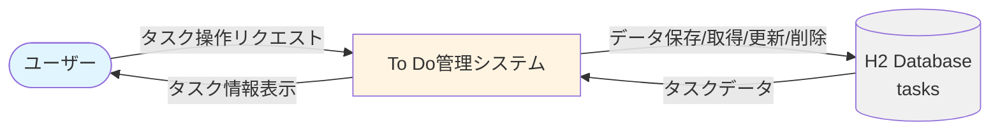

### データフロー説明

| データフロー名 | 送信元 | 送信先 | 内容 |
|------------|-------|-------|------|
| タスク操作リクエスト | ユーザー | システム | タスクの作成、更新、削除、表示、フィルタリングのリクエスト |
| タスク情報表示 | システム | ユーザー | タスク一覧、編集画面などのHTMLページ |
| データ保存/取得/更新/削除 | システム | データベース | SQLクエリによるCRUD操作 |
| タスクデータ | データベース | システム | タスク情報のレコード |

---

## 2. レベル1 DFD（機能別詳細図）

### 2.1 全体の機能とデータフロー

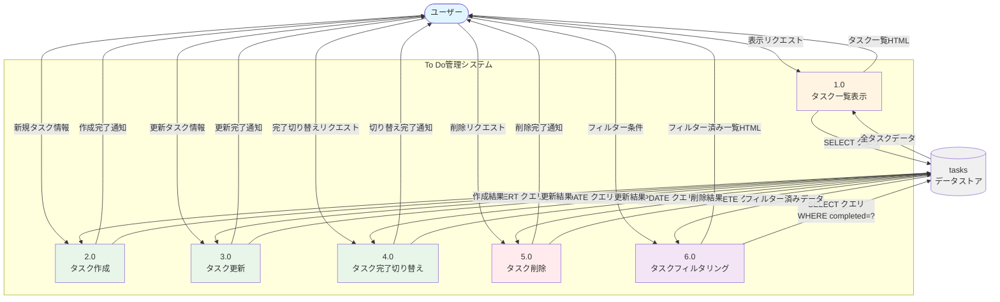

---

## 3. 各プロセスの詳細データフロー

### 3.1 プロセス 1.0: タスク一覧表示

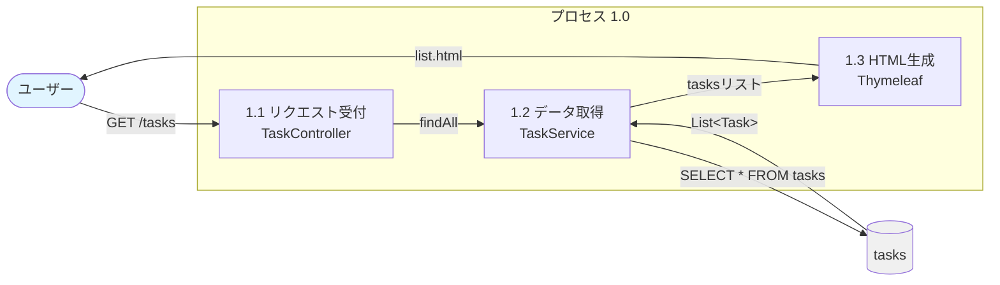

**入力データ**:
- HTTPリクエスト: `GET /tasks`

**処理内容**:
1. コントローラーがリクエストを受け付け
2. サービス層がリポジトリ経由でデータを取得
3. Thymeleafがモデルデータを使ってHTMLを生成

**出力データ**:
- タスク一覧HTML（list.html）

**データストア操作**:
```sql
SELECT id, title, completed, created_at, updated_at
FROM tasks
ORDER BY created_at DESC;
```

---

### 3.2 プロセス 2.0: タスク作成

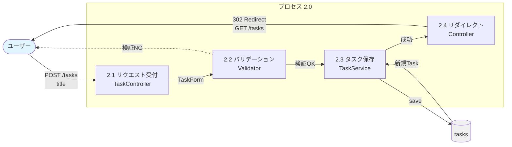

**入力データ**:
- HTTPリクエスト: `POST /tasks`
- リクエストボディ: `title` (String)

**処理内容**:
1. コントローラーがフォームデータを受け取り
2. バリデーション実施（タイトル必須チェック）
3. 検証OKならサービス層でタスクを保存
4. リダイレクトでタスク一覧表示

**出力データ**:
- 成功時: リダイレクト（302）→ `GET /tasks`
- 失敗時: エラーメッセージ付きフォーム

**データストア操作**:
```sql
INSERT INTO tasks (title, completed, created_at, updated_at)
VALUES (?, false, CURRENT_TIMESTAMP, CURRENT_TIMESTAMP);
```

---

### 3.3 プロセス 3.0: タスク更新

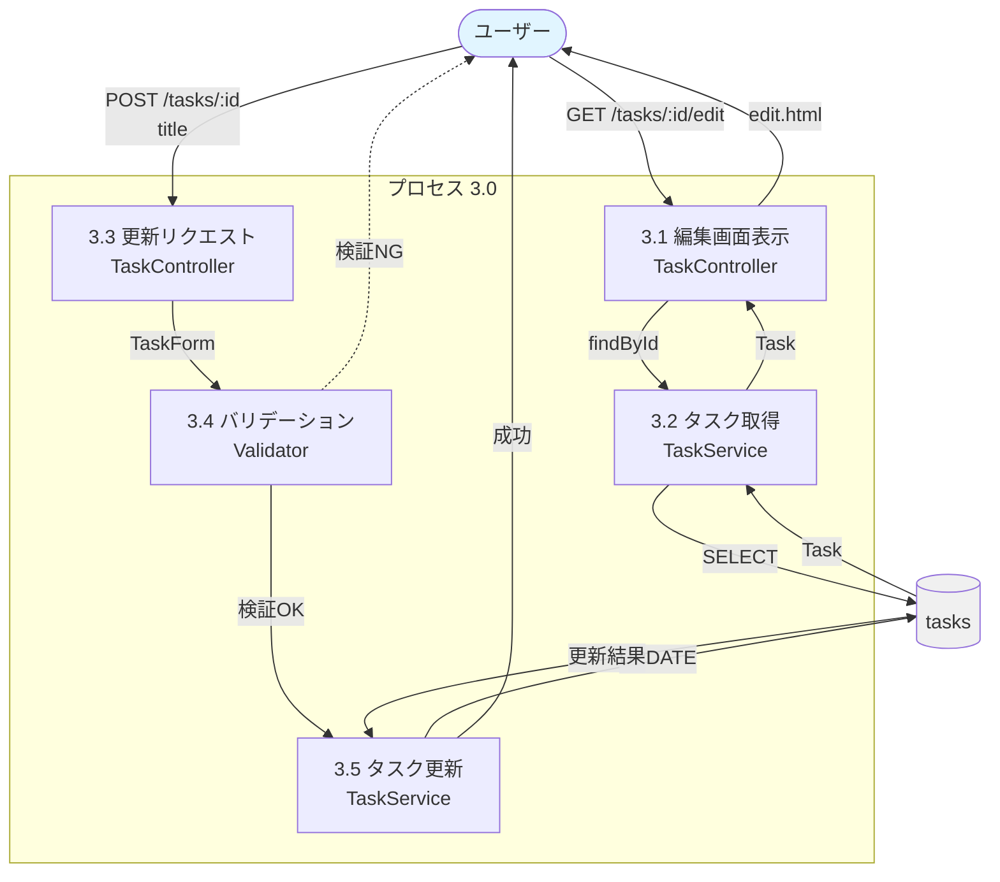

**入力データ（編集画面表示）**:
- HTTPリクエスト: `GET /tasks/{id}/edit`
- パスパラメータ: `id` (Long)

**入力データ（更新）**:
- HTTPリクエスト: `POST /tasks/{id}`
- リクエストボディ: `title` (String)

**処理内容**:
1. 編集画面表示時: IDでタスクを取得して表示
2. 更新時: フォームデータをバリデーション
3. 検証OKならタスクを更新
4. リダイレクトでタスク一覧表示

**出力データ**:
- 編集画面: edit.html
- 更新成功: リダイレクト（302）→ `GET /tasks`

**データストア操作**:
```sql
-- 取得
SELECT id, title, completed, created_at, updated_at
FROM tasks
WHERE id = ?;

-- 更新
UPDATE tasks
SET title = ?, updated_at = CURRENT_TIMESTAMP
WHERE id = ?;
```

---

### 3.4 プロセス 4.0: タスク完了切り替え

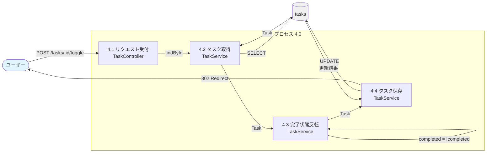

**入力データ**:
- HTTPリクエスト: `POST /tasks/{id}/toggle`
- パスパラメータ: `id` (Long)

**処理内容**:
1. IDでタスクを取得
2. 完了フラグを反転（true ⇔ false）
3. 更新したタスクを保存
4. リダイレクトでタスク一覧表示

**出力データ**:
- リダイレクト（302）→ `GET /tasks`

**データストア操作**:
```sql
-- 取得と更新を1つのクエリで実行
UPDATE tasks
SET completed = NOT completed, updated_at = CURRENT_TIMESTAMP
WHERE id = ?;
```

---

### 3.5 プロセス 5.0: タスク削除

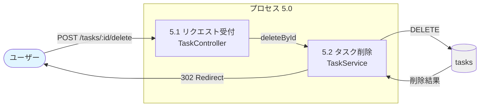

**入力データ**:
- HTTPリクエスト: `POST /tasks/{id}/delete`
- パスパラメータ: `id` (Long)

**処理内容**:
1. IDでタスクを削除
2. リダイレクトでタスク一覧表示

**出力データ**:
- リダイレクト（302）→ `GET /tasks`

**データストア操作**:
```sql
DELETE FROM tasks WHERE id = ?;
```

---

### 3.6 プロセス 6.0: タスクフィルタリング

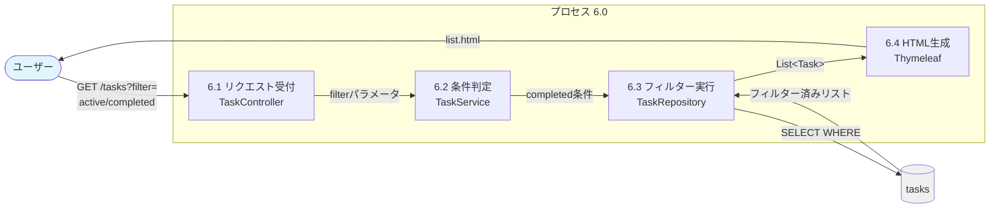

**入力データ**:
- HTTPリクエスト: `GET /tasks?filter={status}`
- クエリパラメータ: `filter` (String)
  - `all`: 全タスク
  - `active`: 未完了のみ
  - `completed`: 完了済みのみ

**処理内容**:
1. フィルターパラメータを受け取り
2. 条件に応じてクエリを実行
3. フィルター済みデータでHTMLを生成

**出力データ**:
- フィルター済みタスク一覧HTML（list.html）

**データストア操作**:
```sql
-- すべて
SELECT * FROM tasks ORDER BY created_at DESC;

-- 未完了のみ
SELECT * FROM tasks WHERE completed = false ORDER BY created_at DESC;

-- 完了済みのみ
SELECT * FROM tasks WHERE completed = true ORDER BY created_at DESC;
```

---

## 4. レイヤー別データフロー

Spring Bootの3層アーキテクチャにおけるデータフロー

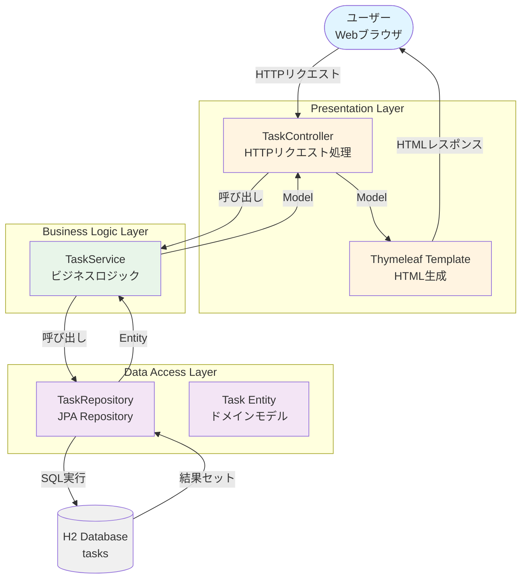

### レイヤー間のデータ型

| レイヤー | 入力データ型 | 出力データ型 |
|---------|------------|------------|
| Controller → Service | TaskForm (DTO) | Task (Entity) |
| Service → Repository | Long (ID), Task (Entity) | Task, List&lt;Task&gt;, Optional&lt;Task&gt; |
| Repository → Database | SQL + パラメータ | ResultSet |
| Service → Controller | Task, List&lt;Task&gt; | Model (Map) |
| Controller → View | Model | - |
| View → User | - | HTML (String) |

---

## 5. 主要なデータ変換フロー

### 5.1 タスク作成時のデータ変換

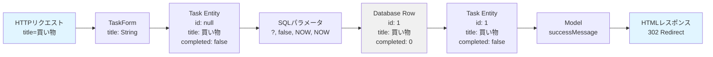

### 5.2 タスク取得時のデータ変換

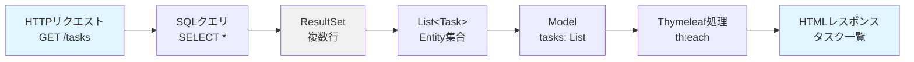

---

## 6. データフロー制御

### 6.1 正常系フロー

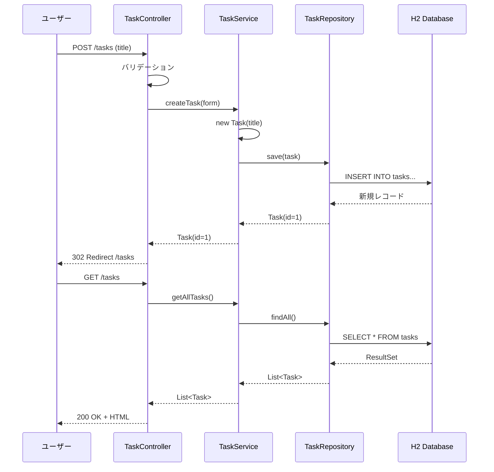

### 6.2 異常系フロー（バリデーションエラー）

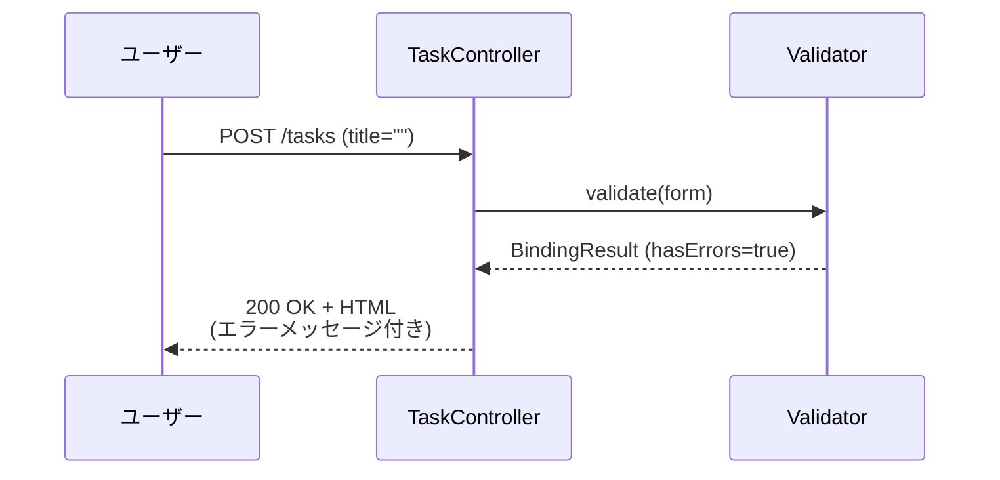

### 6.3 異常系フロー（データ未存在）

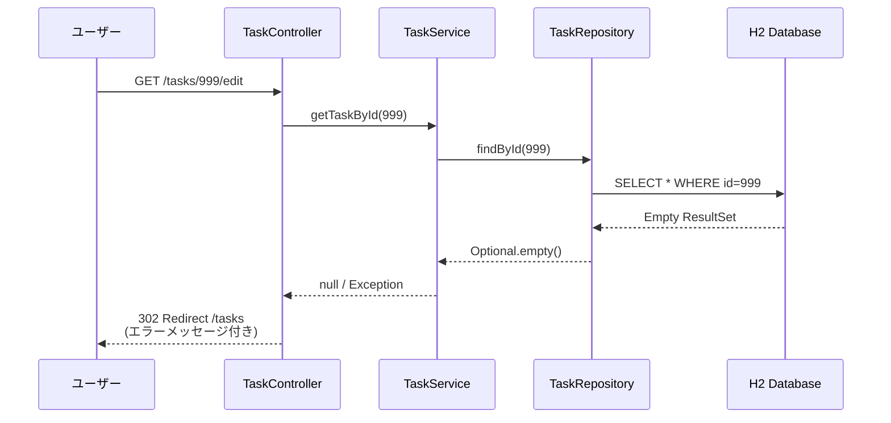

---

## 7. データストアとの相互作用パターン

### 7.1 読み取りパターン

| 操作 | SQLクエリ | トランザクション | レスポンスタイム |
|-----|---------|--------------|----------------|
| 全件取得 | SELECT * | 不要（READ ONLY） | < 10ms |
| ID検索 | SELECT * WHERE id=? | 不要（READ ONLY） | < 1ms |
| 条件検索 | SELECT * WHERE completed=? | 不要（READ ONLY） | < 10ms |

### 7.2 書き込みパターン

| 操作 | SQLクエリ | トランザクション | ロールバック条件 |
|-----|---------|--------------|----------------|
| 作成 | INSERT INTO | 必要 | バリデーションエラー |
| 更新 | UPDATE SET WHERE | 必要 | データ未存在、バリデーションエラー |
| 削除 | DELETE WHERE | 必要 | データ未存在 |

### 7.3 トランザクション境界

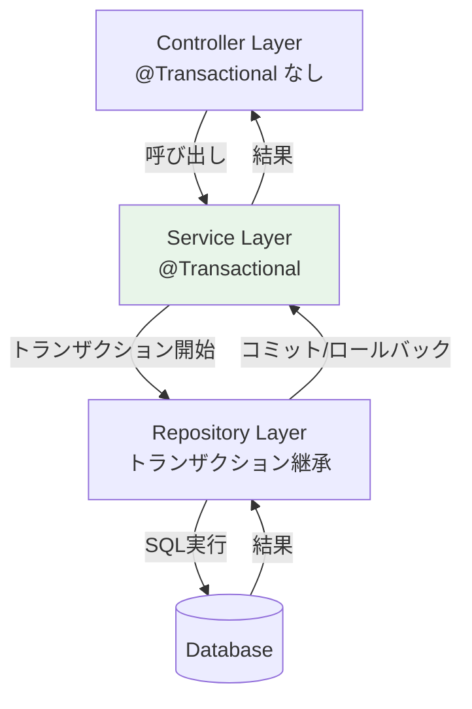

---

## 8. データフロー図の凡例

### 記号の意味

| 記号 | 名称 | 説明 |
|-----|------|------|
| ○ または 丸角四角形 | 外部エンティティ | システム外部の人やシステム（ユーザー） |
| □ または 四角形 | プロセス | データを変換・処理する機能 |
| ⬜ または 開いた四角形 | データストア | データが保存される場所（データベース） |
| → | データフロー | データの流れと方向 |

### プロセス番号の体系

- **1.0〜**: 参照系処理（データ取得、表示）
- **2.0〜**: 作成系処理（新規データ登録）
- **3.0〜**: 更新系処理（既存データ変更）
- **4.0〜**: 状態変更系処理（フラグ切り替え）
- **5.0〜**: 削除系処理（データ削除）
- **6.0〜**: 検索・フィルタリング処理

---

## 9. まとめ

### データフローの特徴

1. **単純な一方向フロー**: ユーザー → システム → データベース → システム → ユーザー
2. **PRGパターン**: POST後は必ずGETにリダイレクト
3. **レイヤー分離**: プレゼンテーション層、ビジネスロジック層、データアクセス層が明確
4. **トランザクション管理**: サービス層で一貫性を保証
5. **バリデーション**: コントローラー層で入力検証

### データの整合性保証

- **一貫性**: トランザクション制御による
- **妥当性**: バリデーション機能による
- **一意性**: 主キー制約による
- **参照整合性**: 現在は単一テーブルのため不要（将来の拡張時に考慮）

### パフォーマンス考慮

- **キャッシング**: 現時点では不要（データ量が少ない）
- **インデックス**: completed、created_atにインデックス設定済み
- **ページング**: 将来的にデータ量増加時に検討
