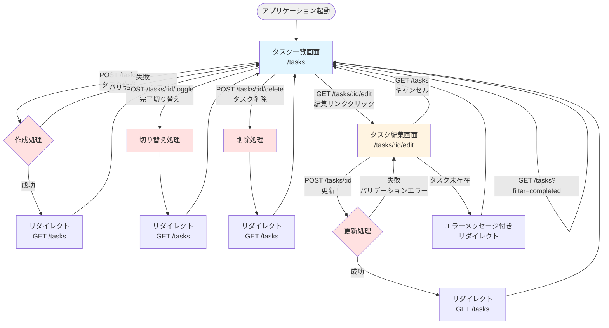
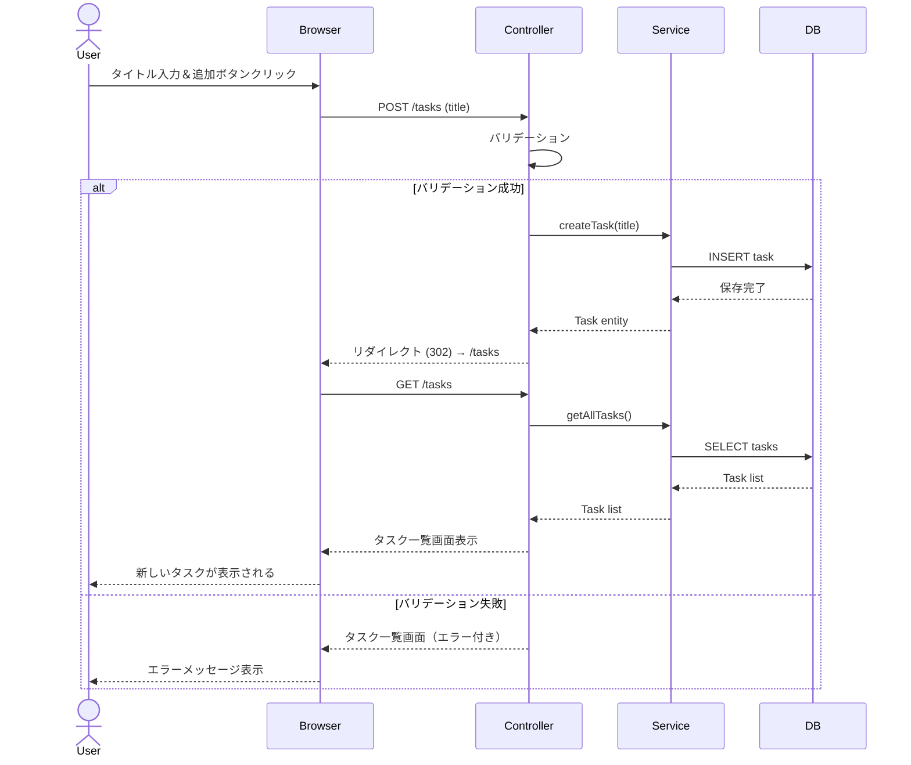
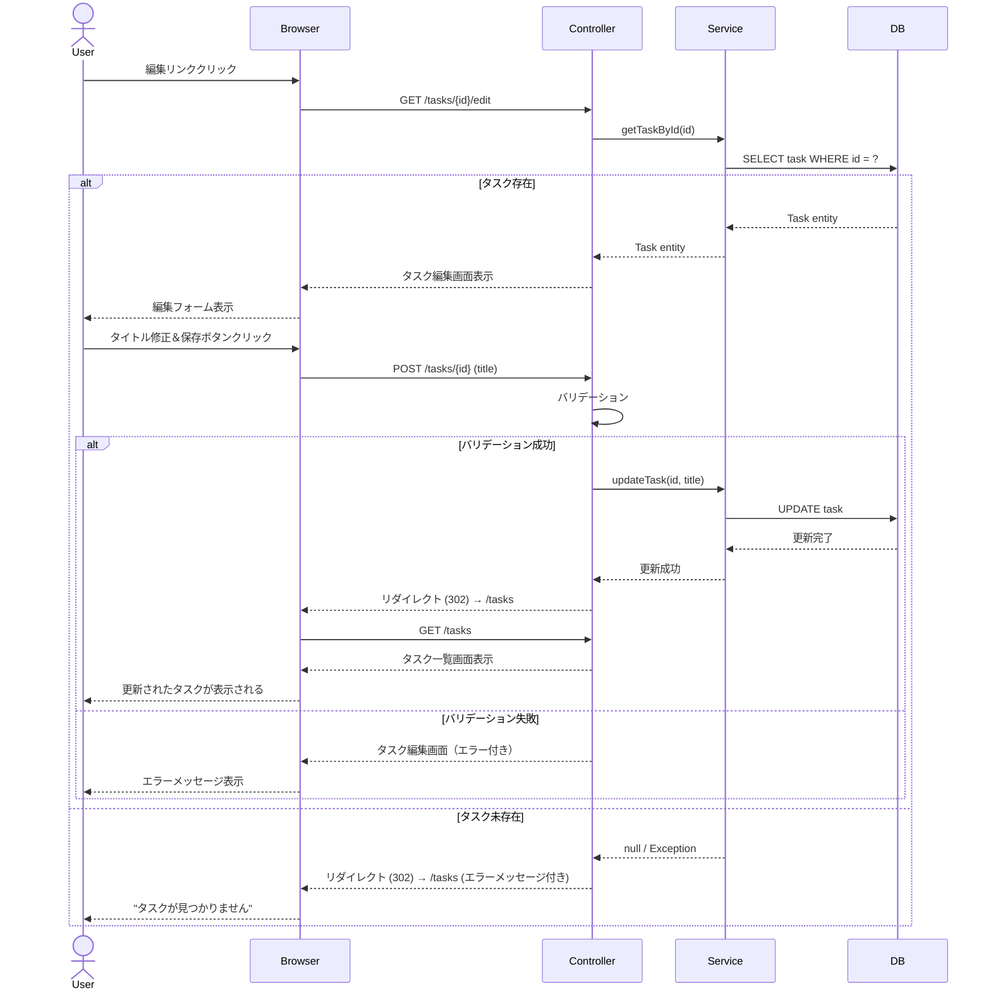
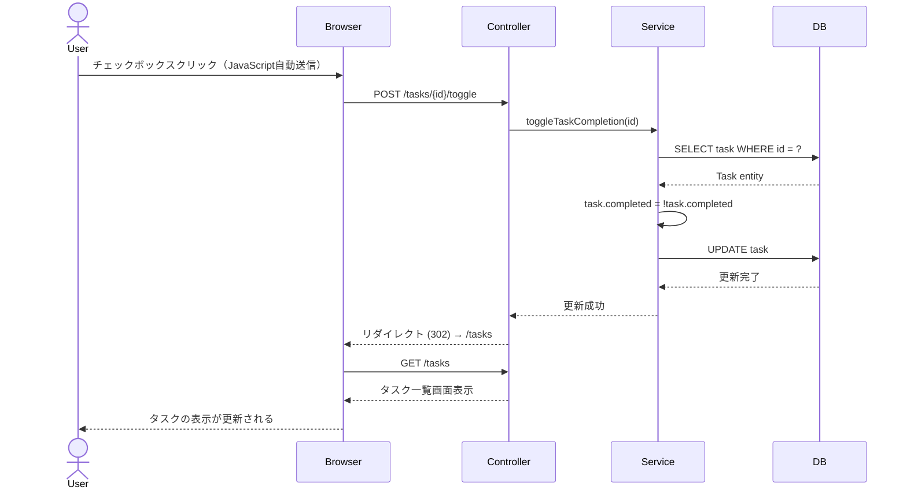

# To Do管理アプリケーション - 画面部品一覧と画面遷移図

## 1. タスク一覧画面（メイン画面）

### 基本情報
- **画面ID**: SCR-001
- **画面名**: タスク一覧画面
- **URL**: `/` または `/tasks`
- **HTTPメソッド**: GET
- **パラメータ**: `filter` (optional) - 値: `all`, `active`, `completed`

### 画面部品一覧

#### ヘッダーセクション

| 部品ID | 部品種類 | 部品名 | 説明 | 必須/任意 | 備考 |
|--------|---------|--------|------|----------|------|
| H-001 | テキスト | アプリケーションタイトル | 「To Do 管理」などのタイトル表示 | 必須 | `<h1>` タグ |

#### タスク作成セクション

| 部品ID | 部品種類 | 部品名 | 説明 | 必須/任意 | 備考 |
|--------|---------|--------|------|----------|------|
| C-001 | フォーム | タスク作成フォーム | タスク作成用のフォーム要素 | 必須 | `<form method="POST" action="/tasks">` |
| C-002 | テキスト入力 | タスクタイトル入力欄 | 新規タスクのタイトルを入力 | 必須 | `name="title"`, `placeholder="新しいタスクを入力"`, `maxlength="255"` |
| C-003 | ボタン | 追加ボタン | タスクを追加するボタン | 必須 | `type="submit"`, ラベル: "追加" |
| C-004 | エラーメッセージ | バリデーションエラー表示 | タイトル未入力時のエラー | 条件付き | `th:if="${#fields.hasErrors('title')}"` |

#### フィルターセクション

| 部品ID | 部品種類 | 部品名 | 説明 | 必須/任意 | 備考 |
|--------|---------|--------|------|----------|------|
| F-001 | ナビゲーション | フィルタータブ | タスクの表示切り替え | 必須 | タブまたはボタングループ |
| F-002 | リンク/ボタン | すべて | 全タスクを表示 | 必須 | `href="/tasks"` または `href="/tasks?filter=all"` |
| F-003 | リンク/ボタン | 未完了 | 未完了タスクのみ表示 | 必須 | `href="/tasks?filter=active"` |
| F-004 | リンク/ボタン | 完了済み | 完了済みタスクのみ表示 | 必須 | `href="/tasks?filter=completed"` |
| F-005 | インジケーター | 選択中フィルター表示 | 現在選択中のフィルター強調表示 | 必須 | アクティブな状態を視覚的に表現 |

#### タスクリストセクション

| 部品ID | 部品種類 | 部品名 | 説明 | 必須/任意 | 備考 |
|--------|---------|--------|------|----------|------|
| L-001 | リスト | タスクリストコンテナ | タスク一覧を格納 | 必須 | `<ul>` または `<div>` |
| L-002 | テキスト | 空リストメッセージ | タスクがない時の表示 | 条件付き | `th:if="${#lists.isEmpty(tasks)}"`, "タスクがありません" |
| L-003 | リスト項目 | タスク行 | 各タスクの表示行 | 条件付き | `th:each="task : ${tasks}"` |

#### タスク行の部品（L-003の子要素）

| 部品ID | 部品種類 | 部品名 | 説明 | 必須/任意 | 備考 |
|--------|---------|--------|------|----------|------|
| T-001 | フォーム | 完了切り替えフォーム | タスク完了状態を切り替え | 必須 | `<form method="POST" action="/tasks/{id}/toggle">` |
| T-002 | チェックボックス | 完了チェックボックス | タスクの完了/未完了を表示・切り替え | 必須 | `checked="${task.completed}"`, クリックでフォーム送信 |
| T-003 | テキスト | タスクタイトル表示 | タスクのタイトルを表示 | 必須 | `th:text="${task.title}"`, 完了時は打ち消し線 |
| T-004 | リンク | 編集リンク | タスク編集画面へ遷移 | 必須 | `href="/tasks/{id}/edit"`, ラベル: "編集" |
| T-005 | フォーム+ボタン | 削除ボタン | タスクを削除 | 必須 | `<form method="POST" action="/tasks/{id}/delete">`, ボタンラベル: "削除" |

#### その他

| 部品ID | 部品種類 | 部品名 | 説明 | 必須/任意 | 備考 |
|--------|---------|--------|------|----------|------|
| M-001 | メッセージ | 成功メッセージ | 操作成功時のフィードバック | 任意 | `th:if="${successMessage}"`, フラッシュメッセージ |
| M-002 | メッセージ | エラーメッセージ | 操作失敗時のエラー表示 | 条件付き | `th:if="${errorMessage}"`, フラッシュメッセージ |

---

## 2. タスク編集画面

### 基本情報
- **画面ID**: SCR-002
- **画面名**: タスク編集画面
- **URL**: `/tasks/{id}/edit`
- **HTTPメソッド**: GET
- **パラメータ**: `id` (required) - タスクID

### 画面部品一覧

#### ヘッダーセクション

| 部品ID | 部品種類 | 部品名 | 説明 | 必須/任意 | 備考 |
|--------|---------|--------|------|----------|------|
| E-H-001 | テキスト | ページタイトル | 「タスクの編集」 | 必須 | `<h1>` タグ |
| E-H-002 | リンク | 戻るリンク | タスク一覧画面へ戻る | 必須 | `href="/tasks"`, ラベル: "← 戻る" または "キャンセル" |

#### 編集フォームセクション

| 部品ID | 部品種類 | 部品名 | 説明 | 必須/任意 | 備考 |
|--------|---------|--------|------|----------|------|
| E-F-001 | フォーム | タスク編集フォーム | タスク更新用フォーム | 必須 | `<form method="POST" action="/tasks/{id}">` |
| E-F-002 | 隠しフィールド | タスクID | 編集対象のタスクID | 必須 | `<input type="hidden" name="id" th:value="${task.id}">` |
| E-F-003 | ラベル | タイトルラベル | 入力欄のラベル | 必須 | `<label for="title">タスクタイトル</label>` |
| E-F-004 | テキスト入力 | タスクタイトル入力欄 | タスクタイトルを編集 | 必須 | `name="title"`, `th:value="${task.title}"`, `maxlength="255"` |
| E-F-005 | エラーメッセージ | バリデーションエラー表示 | タイトルのエラーメッセージ | 条件付き | `th:if="${#fields.hasErrors('title')}"`, `th:errors="*{title}"` |
| E-F-006 | ボタン | 保存ボタン | 変更を保存 | 必須 | `type="submit"`, ラベル: "保存" |
| E-F-007 | リンク/ボタン | キャンセルボタン | 変更を破棄して一覧へ戻る | 必須 | `href="/tasks"` または `type="button"`, ラベル: "キャンセル" |

#### その他

| 部品ID | 部品種類 | 部品名 | 説明 | 必須/任意 | 備考 |
|--------|---------|--------|------|----------|------|
| E-M-001 | メッセージ | エラーメッセージ | タスクが見つからない場合など | 条件付き | `th:if="${errorMessage}"` |

---

## 3. 画面遷移図

### 全体遷移図（Mermaid記法）



### 詳細遷移表

| 開始画面 | アクション | HTTPメソッド | URL | パラメータ | 成功時の遷移先 | 失敗時の遷移先 |
|---------|----------|------------|-----|----------|--------------|--------------|
| タスク一覧 | 画面表示 | GET | `/tasks` | filter (optional) | - | - |
| タスク一覧 | フィルター切り替え | GET | `/tasks` | filter=all/active/completed | タスク一覧（同画面） | - |
| タスク一覧 | タスク作成 | POST | `/tasks` | title | タスク一覧（リダイレクト） | タスク一覧（エラー表示） |
| タスク一覧 | 完了切り替え | POST | `/tasks/{id}/toggle` | id | タスク一覧（リダイレクト） | タスク一覧（エラー表示） |
| タスク一覧 | タスク削除 | POST | `/tasks/{id}/delete` | id | タスク一覧（リダイレクト） | タスク一覧（エラー表示） |
| タスク一覧 | 編集リンク | GET | `/tasks/{id}/edit` | id | タスク編集画面 | タスク一覧（エラー表示） |
| タスク編集 | 画面表示 | GET | `/tasks/{id}/edit` | id | - | タスク一覧（エラー表示） |
| タスク編集 | タスク更新 | POST | `/tasks/{id}` | id, title | タスク一覧（リダイレクト） | タスク編集（エラー表示） |
| タスク編集 | キャンセル | GET | `/tasks` | - | タスク一覧 | - |

---

## 4. ユーザー操作フロー

### フロー1: タスクの新規作成



### フロー2: タスクの編集



### フロー3: タスクの完了切り替え



---

## 5. 画面レイアウト構成

### タスク一覧画面のレイアウト

```
┌─────────────────────────────────────────┐
│  To Do 管理                 [ヘッダー]   │
├─────────────────────────────────────────┤
│  [新しいタスクを入力...] [追加]         │  ← タスク作成フォーム
├─────────────────────────────────────────┤
│  [すべて] [未完了] [完了済み]           │  ← フィルター
├─────────────────────────────────────────┤
│  ☐ タスク1  [編集] [削除]              │  ← タスク行
│  ☑ タスク2  [編集] [削除]              │
│  ☐ タスク3  [編集] [削除]              │
│  ...                                     │
└─────────────────────────────────────────┘
```

### タスク編集画面のレイアウト

```
┌─────────────────────────────────────────┐
│  ← 戻る                                  │
│  タスクの編集                            │
├─────────────────────────────────────────┤
│  タスクタイトル                          │
│  [既存のタスクタイトル____________]     │
│                                          │
│  [保存] [キャンセル]                    │
└─────────────────────────────────────────┘
```

---

## 6. 実装時の注意事項

### PRG（Post-Redirect-Get）パターン
- すべてのPOSTリクエスト後は必ずGETへリダイレクト
- ブラウザの再読み込みによる二重送信を防止

### CSRF対策
- Spring SecurityのCSRF保護を有効化
- すべてのフォームに`th:action`を使用してCSRFトークンを自動挿入

### JavaScriptの使用
- チェックボックスクリック時の自動送信（オプション）
- 削除時の確認ダイアログ（オプション）
- 基本的にはJavaScript不要で動作する設計

### レスポンシブ対応
- モバイル表示時はボタンを縦並びに
- タッチ操作しやすいボタンサイズ（最小44x44px）
